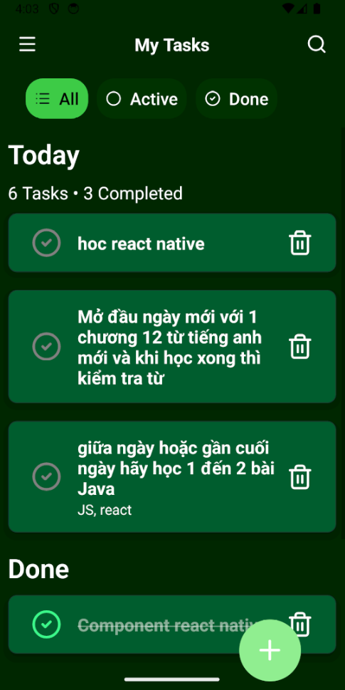
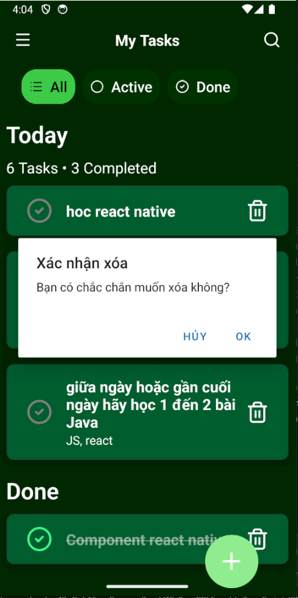

##  Kết quả thực hiện (Screenshots)
### 1. Quản lý danh sách công việc (Main Screen)

---

### 2. Thêm mới Todo & Validation

---

### 3. Xử lý bắt lỗi (Validation)

 

---

### 4. Xóa công việc & Record dữ liệu

